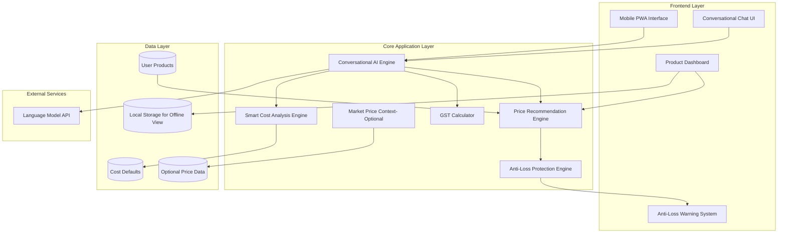

# Design Document: AI Pricing Assistant

## Overview

The AI Pricing Assistant transforms pricing confusion into profitable confidence through a mobile-first conversational interface. Built specifically for Indian micro-sellers, it delivers safe, profitable prices in under 3 minutes while preventing costly underpricing mistakes.

## Core Design Philosophy

**Conversation-First Architecture**: Replace intimidating business forms with natural Hinglish chat that adapts to each seller's knowledge level and business context.

**Anti-Loss Protection**: Hard-coded safeguards prevent below-cost pricing with prominent warnings and minimum safe price enforcement.

**Mobile-Native Experience**: Optimized for Instagram/WhatsApp sellers using smartphones as their primary business tool.

## Key Design Principles

1. **Under-3-Minute Flow (Happy Path < 90s)**: Streamlined journey from product description to three-tier pricing with minimal inputs  
2. **Uncertainty-Friendly**: AI estimates missing costs instead of blocking progress; assumed values are always visible and editable  
3. **GST-Smart (Optional)**: GST breakdown based on registration status; GST rate shown as an estimate and user-selected (or skipped)  
4. **Assumption Transparency**: Clear confidence indicators and editable assumptions for every inferred value  
5. **Offline-Tolerant**: Users can view saved pricing cards offline; pricing recomputation requires network connectivity  

---

## Product Flow Design

### Pricing Journey

```mermaid
graph TD
    A[Chat Start: What do you sell?] --> B[Natural Product Description]
    B --> C[AI Extracts: Name, Category, Type]
    C --> D{Need Clarification?}
    D -->|Yes| E[3-6 Contextual Options + "Don't Know"]
    D -->|No| F[Smart Cost Discovery]
    E --> F
    F --> G[Ask key costs (materials, packaging, time-to-make)]
    G --> H{Missing/Unsure?}
    H -->|Yes| I[Estimate missing costs + mark as Assumed]
    H -->|No| J[Costs ready]
    I --> J
    J --> K{GST step?}
    K -->|Skip| M[Generate Three-Tier Pricing]
    K -->|Continue| L[GST registered? + choose estimated rate or Not sure]
    L --> M
    M --> N[Display: Low/Best/Premium + profit breakdown]
    N --> O[Anti-Loss: enforce Minimum Safe Price + warning]
    O --> P[Save pricing card]
```

---

## Core User Experience Flow

**Step 1: Conversational Intake (~20–30 seconds)**  
- Natural language product description in Hinglish  
- AI extracts product name, category, handmade/reselling type  
- Contextual options when AI needs clarification  
- "Don't know" always available to proceed with assumptions  

**Step 2: Smart Cost Analysis (~40–60 seconds)**  
- AI suggests key cost categories by product type  
- Captures minimum viable costs: **materials, packaging, time-to-make**  
- Industry-typical ranges for uncertain inputs  
- Skip-friendly: proceeds with AI assumptions  
- Confidence indicators (High/Medium/Low) for transparency  
- Assumed values are visible and editable  

**Step 3: GST-Aware Calculations (Optional, ~15–30 seconds)**  
- Simple "Are you GST registered?" question  
- User can skip GST entirely  
- AI suggests estimated GST categories/rates with explicit user selection  
- Uses standard Indian rate options (5%, 12%, 18%, 28%)  

**Step 4: Three-Tier Results (Instant)**  
- Low / Best / Premium pricing tiers with profit breakdown  
- Psychological pricing applied (rounding)  
- Interactive slider that enforces Minimum Safe Price  

**Step 5: Save & Track (Instant)**  
- Mobile-optimized product cards on dashboard  
- One-tap editing through conversational interface  
- Saved cards can be viewed offline (PWA support)  

---

## System Architecture

### Modular Architecture with Anti-Loss Protection



---

## Technology Stack (MVP-Friendly)

**Frontend**: React/Next.js PWA with TypeScript (mobile-first)  
**Backend**: Node.js API (can be serverless/Express depending on hackathon setup)  
**Storage**: Local storage for MVP persistence + optional Postgres for multi-device persistence  
**AI/ML**: OpenAI model for conversational interface and product extraction  
**Auth**: Optional for MVP; OTP/login as future enhancement  

---

## Core Components

### 1. Conversational AI Engine

**Purpose**: Transforms complex pricing into natural conversation, extracting product info and guiding users through the under-3-minute journey.

**Key Capabilities**:
- Natural language product extraction from Hinglish descriptions 
- Optional image-assisted product understanding (extracts basic product cues to support name/category/type extraction) 
- Context-aware option generation when clarification needed (3-6 options + "Don't know")  
- Progressive cost discovery without overwhelming users  
- Assumption transparency with confidence scoring  

```ts
interface ConversationalEngine {
  startPricingFlow(userId: string): ChatSession
  extractProductInfo(description: string): ProductInfo
  generateContextualOptions(context: string): SelectableOption[]
  handleUncertainty(field: string, userInput: string): AssumptionResult
}
```

---

### 2. Smart Cost Analysis Engine

**Purpose**: Guides users through cost discovery with AI-powered suggestions and conservative industry defaults for missing information.

**Key Capabilities**:
- Product-type-specific cost categories (materials, packaging, time-to-make, overhead)  
- Industry-typical ranges for uncertain inputs  
- Seamless default application for "Don't know" responses  
- Confidence level calculation (High/Medium/Low) based on data completeness  
- Assumed values are visible and editable  
- Conservative assumption mode for Low confidence  

```ts
interface SmartCostEngine {
  suggestCostCategories(productType: string, category: string): CostComponent[]
  estimateMissingCosts(partialCosts: Partial<CostBreakdown>): CostBreakdown
  calculateConfidenceLevel(userInputs: CostInput[], assumptions: Assumption[]): ConfidenceLevel
  applyIndustryDefaults(category: string, productType: ProductType): DefaultCosts
}
```

---

### 3. GST Calculator (Optional)

**Purpose**: Simplifies Indian tax complexity into a single yes/no question and a user-selected GST rate (or skip).

**Key Capabilities**:
- Simple "Are you GST registered? (Yes/No)" question  
- User can skip GST entirely  
- Suggests 2–4 estimated GST options + "Not sure / Skip"  
- Standard rate options (5%, 12%, 18%, 28%)  
- Clear breakdown: base price + GST + final customer price (if enabled)  

```ts
interface GSTCalculator {
  suggestCategory(productInfo: ProductInfo): GSTCategorySuggestion
  calculate(basisPrice: number, gstRate: number): GSTBreakdown
}

interface GSTCategorySuggestion {
  suggestedCategories: { label: string; gstRate: number; confidence: ConfidenceLevel }[]
  includesNotSure: true
}

interface GSTBreakdown {
  basisPrice: number
  gstRate: number
  gstAmount: number
  customerPrice: number
}
```

---

### 4. Anti-Loss Protection Engine

**Purpose**: Core differentiator that prevents costly underpricing mistakes through hard safeguards and prominent warnings.

**Key Capabilities**:
- Calculates Minimum Safe Price with adjustable safety buffer  
- Generates prominent loss warnings: "You lose ₹X per sale at ₹Y price. Minimum safe price: ₹Z"  
- Enforces minimum pricing through interactive slider constraints  
- Blocks finalization below Minimum Safe Price  

```ts
interface AntiLossEngine {
  calculateMinimumSafePrice(costs: CostBreakdown): number
  generateLossWarning(proposedPrice: number, costs: CostBreakdown): LossWarning
  enforceSafePricing(userPrice: number, minimumPrice: number): PriceValidation
}
```

---

### 5. Three-Tier Pricing Engine

**Purpose**: Generates Low/Best/Premium pricing options with psychological pricing rules and clear profit breakdowns.

**Key Capabilities**:
- Low tier: Lowest viable pricing but never below Minimum Safe Price  
- Best tier: Recommended healthy margin  
- Premium tier: Higher-margin positioning  
- Psychological pricing rules (₹249, ₹299, ₹5/₹10 increments)  
- Profit margin % + absolute profit amount for each tier  
- Explainable reasoning for each recommendation  
- Interactive price slider with real-time updates  

**Tier Computation (Deterministic Defaults)**:
- Let **C** = Total Cost (including assumed values)  
- Let **S** = Safety buffer (default 10% of C, user-adjustable)  
- **Minimum Safe Price (MSP)** = C + S  

Default margin presets (tunable later):
- **Handmade**: low=20%, best=45%, premium=70%  
- **Reselling**: low=10%, best=25%, premium=40%  

Tier formulas (before rounding):
- **Low** = max(MSP, C × (1 + lowMargin))  
- **Best** = max(MSP, C × (1 + bestMargin))  
- **Premium** = max(MSP, C × (1 + premiumMargin))  

Market context (if available) can adjust Low/Best within a band, but never below MSP.

```ts
interface ThreeTierEngine {
  generatePricingTiers(costs: CostBreakdown, gstEnabled?: boolean, gstRate?: number): PricingTiers
  applyPsychologicalPricing(price: number): number
  calculateProfitBreakdown(price: number, costs: CostBreakdown): ProfitAnalysis
  updateTiersOnCostChange(productId: string, newCosts: CostBreakdown): PricingTiers
}

interface PricingTiers {
  low: PriceTier
  best: PriceTier
  premium: PriceTier
  confidence: ConfidenceLevel
  reasoning: string[]
}
```

---

### 6. Optional Market Price Context

**Purpose**: Provides reference pricing context when available; falls back gracefully when unavailable.

**Key Capabilities**:
- Uses curated sample dataset for common products (MVP can start smaller)  
- Displays min/max/median prices with sample count  
- Market match confidence score (High/Medium/Low)  
- Seamless fallback to cost-based pricing when unavailable  
- Integrates with recommendation engine alongside cost analysis  

```ts
interface MarketPriceContext {
  getMarketStats(productCategory: string): MarketStats | null
  calculateMarketConfidence(product: ProductInfo, stats: MarketStats): ConfidenceLevel
  integrateWithPricing(costs: CostBreakdown, marketStats?: MarketStats): PricingTiers
}

interface MarketStats {
  minPrice: number
  maxPrice: number
  medianPrice: number
  sampleCount: number
}
```

---

## Data Models

### Core Product Model

```ts
interface Product {
  id: string
  userId: string
  name: string
  category: string
  type: 'handmade' | 'reselling'
  description?: string

  // Cost Information with Confidence
  costBreakdown: CostBreakdown
  costConfidence: ConfidenceLevel

  // Anti-Loss Protection
  minimumSafePrice: number

  // Three-Tier Pricing
  pricingTiers: PricingTiers
  finalizedPrice?: number

  // GST Settings (Optional)
  gst?: {
    isRegistered: boolean
    chosenRate?: number // user-selected; undefined if skipped/not sure
  }

  // Metadata
  createdAt: Date
  updatedAt: Date
}
```

---

### Enhanced Cost Model with Assumptions

```ts
interface CostBreakdown {
  materialCosts: number
  laborCosts: number
  packagingCosts: number
  overheadCosts: number
  totalCosts: number

  // Transparency
  assumptions: AssumptionRecord[]
  confidence: ConfidenceLevel
  userProvidedFields: string[]
}

interface AssumptionRecord {
  field: string
  assumedValue: number
  reason: string
  confidence: ConfidenceLevel
  userCanEdit: boolean
  industryDefault?: boolean
}
```

---

### Chat Session Model

```ts
interface ChatSession {
  id: string
  userId: string
  productId?: string
  type: 'pricing_flow' | 'cost_refinement' | 'price_update'

  // Conversation State
  messages: ChatMessage[]
  extractedData: Partial<ProductInfo>
  currentStep: FlowStep

  // Progress Tracking
  status: 'active' | 'completed' | 'abandoned'
  completionTime?: number
  createdAt: Date
}

type FlowStep =
  | 'product_intake'
  | 'cost_analysis'
  | 'gst_check'
  | 'pricing_results'
  | 'finalization'
```

---

### User Model

```ts
interface User {
  id: string
  email?: string
  phone?: string

  preferences: {
    language: 'en' | 'hi' | 'hinglish'
    gstRegistered?: boolean
    businessType?: 'handmade' | 'reseller' | 'mixed'
    defaultProfitMargin?: number
  }

  createdAt: Date
  lastLoginAt: Date
}
```

---

## Error Handling & Resilience

### Graceful Degradation Strategy

**AI Service Failures**:
- Fallback to structured flows with predefined options  
- Maintain core pricing functionality without conversational features  
- Error messaging respects user language preference  

**Network Connectivity Issues**:
- Offline viewing of saved pricing cards (PWA)  
- Local storage for draft pricing sessions  
- Pricing recomputation requires connectivity; show clear UI state  

**Data Validation Failures**:
- Never block the flow for missing optional data  
- Apply conservative defaults with visible confidence indicators  
- Allow post-calculation editing of all assumptions  

---

## Anti-Loss Protection Safeguards

**Hard Constraints**:
- Minimum Safe Price enforcement across all pricing tiers  
- Interactive slider cannot go below MSP  
- Prevent finalization of below-cost pricing  

**Soft Warnings**:
- Confidence indicators for assumptions  
- Clear display of estimated vs user-provided values  
- Alerts for unusually low margins  

---

## Testing Strategy

### Dual Testing Approach

The system uses both unit testing and property-based testing for comprehensive coverage.

**Unit Tests** focus on:
- Pricing tier calculation examples and rounding rules  
- GST breakdown math for selected rates  
- Error handling scenarios (network failures, invalid inputs)  
- UI component behavior (button states, slider constraints)  
- Integration points between chat engine and pricing calculator  

**Property-Based Tests** verify universal behaviors:
- No generated tier price is below Minimum Safe Price  
- Below-cost user proposals always trigger loss warning and are blocked from finalization  
- Cost breakdown components always sum correctly to total cost  
- GST breakdown math is correct for the chosen rate (when enabled)  
- Confidence levels reflect user-provided vs assumed fields  

### Property Test Configuration

- **Library**: fast-check for TypeScript property-based testing  
- **Iterations**: Minimum 100 iterations per property test  
- **Tagging**: Feature: `ai-pricing-assistant`, Property `{number}: {description}`  
- **Coverage**: Each correctness property implemented as exactly one property-based test  

### Test Data Strategy

```ts
const productGenerator = fc.record({
  name: fc.string({ minLength: 1, maxLength: 100 }),
  category: fc.constantFrom('electronics', 'clothing', 'food', 'handicrafts'),
  type: fc.constantFrom('handmade', 'reselling'),
  costs: fc.record({
    materialCosts: fc.float({ min: 0, max: 10000 }),
    laborCosts: fc.float({ min: 0, max: 5000 }),
    packagingCosts: fc.float({ min: 0, max: 500 }),
    overheadCosts: fc.float({ min: 0, max: 1000 })
  })
})

const gstScenarioGenerator = fc.record({
  isRegistered: fc.boolean(),
  chosenRate: fc.option(fc.constantFrom(5, 12, 18, 28)),
  basisPrice: fc.float({ min: 1, max: 100000 })
})
```

---

## Correctness Properties

*A property is a characteristic or behavior that should hold true across all valid executions of a system—essentially, a formal statement about what the system should do. Properties bridge human-readable specifications and machine-verifiable correctness guarantees.*

### Property 1: Product Information Extraction
For any user product description, the system extracts at minimum the product name, category, and type (handmade/reselling).

### Property 2: Contextual Options Generation
For any AI parsing failure, the system provides 3-6 selectable options inferred from user input, always including "Don't know".

### Property 3: Default Value Progression
For any "Don't know" selection or missing data, the system proceeds using assumed defaults without blocking the flow.

### Property 4: Cost Category Suggestions
For any product type, the system suggests relevant cost categories (materials, labor/time, packaging, overhead) based on type.

### Property 5: Assumption Transparency and Editability
For any assumed value, the system displays it clearly with confidence level and allows users to edit it.

### Property 6: Confidence Level Accuracy
For any cost breakdown, confidence levels reflect High/Medium/Low based on user-provided vs assumed fields.

### Property 7: GST Optionality
For any pricing flow, GST can be skipped without blocking pricing recommendations.

### Property 8: GST Breakdown Math Correctness
For any chosen GST rate and base price, the system computes GST amount and final customer price correctly when GST is enabled.

### Property 9: Three-Tier Generation
For any pricing request, the system generates exactly three tiers (Low/Best/Premium) with profit margin % and absolute profit.

### Property 10: Psychological Pricing Rules
For any generated tier, the system applies psychological pricing and rounding rules while never going below MSP.

### Property 11: Anti-Loss Protection
For any generated tier, no recommendation goes below Minimum Safe Price; any below-cost user proposal triggers a prominent warning and is blocked from finalization.

### Property 12: Market Data Fallback
For any market context request, if market data is unavailable, the system falls back to cost-based pricing without blocking.

### Property 13: Product Persistence
For any finalized product, the system saves a pricing card with key details (final price, profit margin, last updated), viewable offline.

### Property 14: Conversational Editing
For any saved product, the system supports conversational edits and regenerates pricing recommendations instantly when costs change.

---

## Performance Targets

- End-to-end pricing output (intake → three-tier output) achievable within **3 minutes** average  
- Chat response generation: **< 3 seconds**  
- Mobile page load times: **< 3 seconds** on 3G networks  
